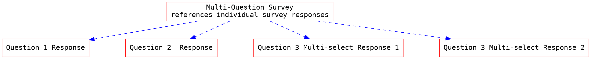

This US Core Social Determinant of Health (SDOH) Guidance Page has been added in response to  United States Core Data for Interoperability (USCDI) V2 updates that the Office of the National Coordinator (ONC) published by the Office of the National Coordinator (ONC) in July of 2021. SDOH data relate to conditions in which people live, learn, work, and play and their effects on health risks and outcomes[^1].<!-- new-content -->  The new data elements include:
- SDOH Assessments
- SDOH Goals
- SDOH Interventions
- SDOH Problems/Health Concerns

This page documents how the US Core Profile can be use to represent these elements.

### Purpose and Intent

The intent of adding these SDOH data elements to US Core is to be able to use US Core Profiles along with a defined set of FHIR RESTful interactions to represent and access SDOH patient data.  This is in contrast to the [SDOH Clinical Care](http://hl7.org/fhir/us/sdoh-clinicalcare/) HL7 Implementation Guide. This guide was developed by the [Gravity Project](https://hl7.org/gravity) and documents the orchestration of SDOH data capture and related interventions and how it is represented using FHIR.  US Core Profile span across use cases and thus less constrained, but they form backbone for the SDOH Clinical Care Profiles.  Many of the additions to US Core Profiles to meet the SDOH data element requirements are based on the efforts by the Gravity led project.  In the following sections the interrelation between the SDOH elements is summarized and how each element is represented in US Core documented.

### Activities

The figure below shows how the SDOH elements are inter-related:

- **SDOH Assessment**: SDOH Assessments represent the recording of SDOH assessment screening tools and other questionnaires as well as individual clinical observations.  These assessments are represented by the [US Core Observation Social History Profile] and [US Core Survey Observation Profile]
- **SDOH Problems/Health Concerns**: Identifying a Social Determinants of Health-related condition (for example, homelessness) is represented by the [US Core Condition Problems and Health Concerns Profile].
- **SDOH Interventions**:  Services offered to a patient to address identified Social Determinants of Health problems/health concerns (for example, referral to transportation support programs) are represented by the [US Core ServiceRequest Profile].  In addition, the [US Core Procedure Profile] can be used to record a completed service or intervention.
- **SDOH Goals**: Identifying and defining a future desired condition or change in condition related to an SDOH risk (for example, Has adequate quality meals and snacks) is represented by [US Core Goal Profile]



### Assessment Screenings

Assessment Screenings can represent a structured evaluation of risk (e.g., PRAPARE, Hunger Vital Sign, AHC-HRSN screening tool) for any Social Determinants of Health domain such as food, housing, or transportation security. They are often captured using a screening tool such as a survey or questionnaire. US Core provides two ways to represent SDOH assessment screening results using:

1. Observation*: [US Core Observation SDOH Assessment Profile]
1. QuestionnaireResponse: [US Core QuestionnaireResponse Profile]

US Core Servers **SHALL** support [US Core Observation SDOH Assessment Profile] for SDOH Assessments and **MAY** support the [US Core QuestionnaireResponse Profile] for SDOH Assessments.

\*Not all questions and answers in an assessment tool may or should be represented as FHIR Observations. For example, patient demographic information is best represented in the FHIR patient resource.
{:.bg-info}

Additionally, the [US Core Social History Assessment Observation Profile] is for simple observations made by an individual during the course of care about a patient's social history status. These Observation can contribute to the identification of SDOH Problems and can be the reason for SDOH Service Requests or Procedures.

#### Assessment Screenings Using Observations

To meets the USCDI v2 requirements for SDOH Assessments, US Core defines the [US Core Observation Survey Profile] and the [US Core Observation SDOH Assessment Profile].  The [US Core Observation Survey Profile] is defined to record responses from a survey or a questionnaire for *any* context including SDOH.  The [US Core Observation SDOH Assessment Profile] is derived from the [US Core Observation Survey Profile] and constrains the category and terminology to SDOH. To keep related data together and preserve the survey structure, these profiles can be used to represent multi-question "panels" of responses, individual responses (including multi-select or "check all that apply" responses).  The figure below illustrates the relationship between the Observation survey "panel" and the individual Observations survey responses. Each box represents an Observation using either profile:

<!---

-->



Note that the panels can be nested to create additional groupings of responses.  See the [US Core Observation Survey Profile] profile page for detailed documentation on how the observations are linked, examples, and search requirements.

The Observations may be extracted from QuestionnaireResponse. [SDOH Clinical Care](http://build.fhir.org/ig/HL7/fhir-sdoh-clinicalcare/survey_instrument_support.html) guides define how sdoh data captured in a QuestionnaireResponse can be extracted and used to create or update Observations or other FHIR resources.
{:.bg-info}

#### Assessment Screenings Using QuestionnaireResponse

Survey instruments may be represented by a Questionnaire including a FHIR Questionnaire. A FHIR QuestionnaireReponse captures the responses to the survey and may be stand-alone or may point to the definition of the questions in a questionnaire (typically a FHIR Questionnaire). The US Core QuestionnaireResponse Profile profile which is based on the [Structured Data Capture (SDC) Questionnaire Response Profile] is  used to capture, exchange and persist the response data. It represents the response data to the individual questions on the form and is ordered and grouped corresponding to the structure and grouping of the Questionnaire being responded to.  Although QuestionnaireResponse can be searched using the standard FHIR RESTful API search parameters, individual responses are not directly searchable in QuestionnaireResponse. In order to search directly for and individual responses, they must be “parsed” into a searchable form - i.e. to a local FHIR or non-FHIR data store such as a database or FHIR Observations.

The basic workflow for the creation, discovery and retrieval and data-extraction of FHIR Questionnaire and QuestionnaireResponse is thoroughly documented in the [Structured Data Capture (SDC)] specification.
{:.bg-info}

See the [US Core QuestionnaireResponse Profile] profile page for detailed documentation, examples and search requirements.

<!-- new-content -->

#### Searching for SDOH Patient Data

Below is a simple example of FHIR RESTful search transaction on Observation to access a patient's SDOH assessment data



### Terminology

#### Category Codes

The LOINC "grouping" code: [LG41762-2] "Social Determinants Of Health" is used to categorize SDOH for Assessments, Problems, and Service Requests. This concept enables API consumers to be able to separate out SDOH data when accessing patient information. Example searches are shown in each of the profile *Quick Start* sections.<!-- new-content -->

 Clients need to be understand that data categorization is somewhat subjective. The categorization applied by the source may not align with the client's expectations. Clients may find it more useful to use queries based on a specific code or set of codes or to perform additional client side filtering of query results.<!-- new-content --><!-- be-warning -->

#### Codes for Problems/HealthConcerns, Goals, Service Requests, and Procedures

For the SDOH Clinical Care HL7 Implementation Guide, the Gravity project has defined the following value sets across specific social risk factor domains for problems/health concerns, goals, procedures, and service requests:

* [Social Determinants of Health Conditions Value Set](https://vsac.nlm.nih.gov/valueset/2.16.840.1.113762.1.4.1196.788/expansion)
* [Social Determinants of Health Procedures Value Set](https://vsac.nlm.nih.gov/valueset/2.16.840.1.113762.1.4.1196.789/expansion)
* [Social Determinants of Health Goals Value Set](https://vsac.nlm.nih.gov/valueset/2.16.840.1.113762.1.4.1247.71/expansion)
* [Social Determinants of Health Service Requests Value Set](https://vsac.nlm.nih.gov/valueset/2.16.840.1.113762.1.4.1196.790/expansion)

US Core uses broadly defined value sets that contain concepts that are used across many use cases including SDOH. The Figure below illustrates how the Gravity value sets are grouped for use in the US Core Condition Problems and Health Concerns Profile and how the grouped valueset is compwatible with the US Core Problem code valueset.   When recording SDOH data US Core Profiles, servers **SHOULD** use the SDOH value sets listed above.



#### Assessment Codes
US Core has created the [US Core Common SDOH Assessments] ValueSet - commonly asked social questions as identified by [FindHelp.org], a social service assistance tool, and  the PRAPARE, Hunger Vital Sign, AHC-HRSN screening tools referenced in USCDI v2.<!-- new-content -->  This is not intended to replicate the complexities and robustness of the FHIR Questionnaire and QuestionnaireResponse resources developed for SDOH assessment screening tools and other questionnaires.  The Gravity Project is working on a more comprehensive set of codes to meet these challenges (this guide may leverage that work in the future).

---

[^1]: As documented in [Future of US Core], US Core may add more detailed work information such as Occupational Data for Health (ODH) in future versions.<!-- new-content -->


